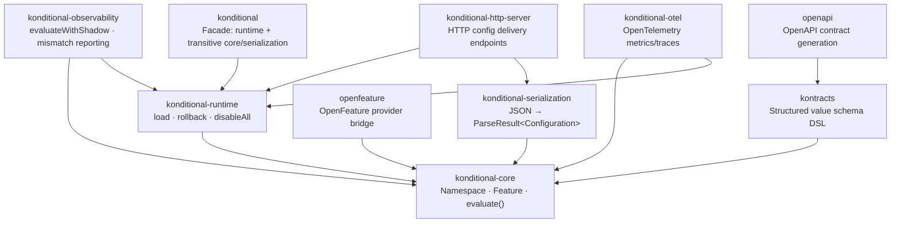

# Module Dependency Map

Pick the smallest set of modules that covers your use case. Most applications can start with the facade module and add specialized modules only when needed.

---

## Dependency Graph

Arrows point from dependent → dependency. `konditional-core` is the only module with no runtime dependencies within
this graph.

---

## Module Reference

### Layer 0 — Facade (recommended default)

**`konditional`** `io.github.amichne:konditional:VERSION`

Default entry point for most applications. This facade depends on `konditional-runtime` and therefore transitively pulls `konditional-core` and `konditional-serialization`.

- Fastest path to typed evaluation + runtime updates + JSON snapshot ingestion
- Prefer this unless you intentionally want a thinner dependency graph
- [Quickstart: Install](/quickstart/install) · [Quickstart: Load your first snapshot](/quickstart/load-first-snapshot-safely)

---

### Layer 1 — Core (always required)

**`konditional-core`** `io.github.amichne:konditional-core:VERSION`

The foundation. Provides the `Namespace` model, typed feature declarations, evaluation API, and deterministic
bucketing primitives. Required for every use case.

- Define features and call `evaluate(...)` in application code
- No runtime, serialization, or observability dependencies
- [Quickstart: Define your first flag](/quickstart/define-first-flag) · [Concept: Features and Types](/concepts/features-and-types)

---

### Layer 2 — Runtime Integration (almost always required)

**`konditional-runtime`** `io.github.amichne:konditional-runtime:VERSION`

Adds `InMemoryNamespaceRegistry` and the runtime lifecycle API (`load`, `rollback`, `disableAll`, history). Required
whenever configuration changes at runtime rather than being baked in at compile time.

- Mutable registry with atomic snapshot swaps
- Rollback to prior snapshots
- Namespace kill-switch (`disableAll`)
- [Quickstart: Load your first snapshot](/quickstart/load-first-snapshot-safely) · [Concept: Configuration Lifecycle](/concepts/configuration-lifecycle)

**`konditional-serialization`** `io.github.amichne:konditional-serialization:VERSION`

Adds `ConfigurationSnapshotCodec` and the `NamespaceSnapshotLoader` for ingesting JSON at the trust boundary.
Required whenever configuration arrives from outside the process (remote endpoints, files, environment).

- `decode(json) → ParseResult<Configuration>` — typed boundary with no silent failures
- Patch application for incremental updates
- Strict and skip modes for unknown key handling
- [Reference: Snapshot Format](/reference/snapshot-format) · [Reference: Patch Format](/reference/patch-format) · [Reference: Snapshot Load Options](/reference/snapshot-load-options)

---

### Layer 3 — Observability (add when migrating or operating at scale)

**`konditional-observability`** `io.github.amichne:konditional-observability:VERSION`

Adds `evaluateWithShadow(...)` for dual-run comparison and mismatch telemetry. Use during migration from a legacy flag
system or when validating a configuration change before promoting it.

- Shadow evaluation: baseline value returned, candidate compared, mismatches surfaced
- `ShadowMismatch` records with value and decision deltas
- [Theory: Migration and Shadowing](/theory/migration-and-shadowing) · [Guide: Migration from Legacy](/guides/migration-from-legacy)

**`konditional-otel`** `io.github.amichne:konditional-otel:VERSION`

Adds OpenTelemetry metrics and traces for the feature evaluation lifecycle. Use when you need standardized telemetry
for dashboards, alerts, and SLO tracking.

- Evaluation latency histograms
- Load/rollback event spans
- [Guide: Enterprise Adoption](/guides/enterprise-adoption)

---

### Layer 4 — Delivery Infrastructure (add for hosted/remote delivery)

**`konditional-http-server`** `io.github.amichne:konditional-http-server:VERSION`

Exposes HTTP endpoints for configuration delivery and runtime operations. Use when you serve configuration to external
consumers rather than loading it in-process.

- REST surface for snapshot push/pull
- Runtime control endpoints (rollback, kill-switch)
- [Guide: Remote Configuration](/guides/remote-configuration)

**`openfeature`** `io.github.amichne:openfeature:VERSION`

Bridges Konditional into the [OpenFeature](https://openfeature.dev) standard. Use when your organization standardizes
on OpenFeature-compatible clients or tooling.

- OpenFeature provider implementation
- Context mapping between OpenFeature and Konditional context types
- [Guide: Enterprise Adoption](/guides/enterprise-adoption)

---

### Layer 5 — Schema and Contracts (add for structured custom values)

**`kontracts`** `io.github.amichne:kontracts:VERSION`

Adds the schema DSL for defining structured custom values with compile-time-enforced constraints. Use when a flag's
value is a structured object rather than a primitive or enum.

- `Konstrained` value DSL with field-level schema annotations
- Codec integration for boundary parsing
- [Guide: Custom Structured Values](/guides/custom-structured-values)

**`openapi`** `io.github.amichne:openapi:VERSION`

Generates OpenAPI schemas from Kontracts definitions. Use when you publish machine-readable API contracts for
external consumers.

- OpenAPI schema generation from `kontracts` DSL
- [Guide: Enterprise Adoption](/guides/enterprise-adoption)

---

## Recommended Starting Points

| Starting point | Modules |
|---|---|
| **Evaluate + load remote config** (most applications) | `konditional` |
| **Evaluate static flags only** (no remote config) | `konditional-core` |
| **Custom minimal graph** | `konditional-core` + `konditional-runtime` + `konditional-serialization` |
| **Migrating from a legacy flag system** | above + `konditional-observability` |
| **Production at scale** (telemetry, hosted delivery) | above + `konditional-otel` + `konditional-http-server` |
| **OpenFeature compatibility** | above + `openfeature` |
| **Structured custom values** | any of above + `kontracts` |

---

## Next Steps

- [Quickstart: Install](/quickstart/install) — Gradle dependency block
- [API Surface](/reference/api-surface) — Public API signatures by module
- [Claims Registry](/theory/claims-registry) — What each module's guarantees are and which tests back them
